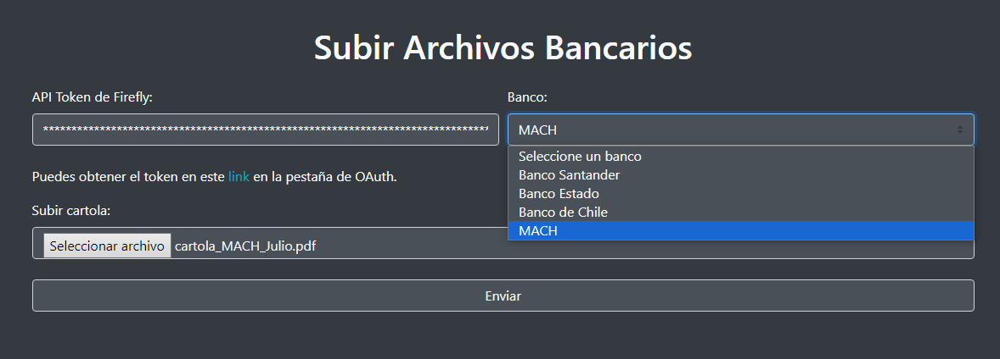
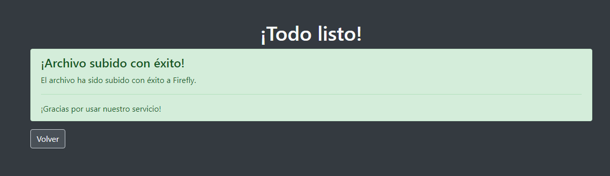

# Firefly III Chile Cartolas Importer

**firefly-iii_chile-cartolas-importer** es una aplicación que te permite importar cartolas bancarias de bancos chilenos a Firefly III mediante el Data Importer. Con soporte para archivos en formato PDF y Excel, esta herramienta facilita la integración de tus datos financieros en Firefly III.

## Características

- **Soporte para múltiples bancos chilenos:** Actualmente, la aplicación soporta:
  - Banco de Chile (Formato Excel)
  - Banco Estado (Formato Excel)
  - Banco Santander (Formato PDF)
  - MACH (Formato PDF)
- **Compatibilidad con PDF y Excel:** Carga tus cartolas en los formatos más comunes utilizados por los bancos.
- **Integración directa con Firefly III:** Envía tus datos financieros directamente a Firefly III mediante el Data Importer.
- **Uso de Docker**: Esta aplicación se inicia fácilmente con Docker Compose.

## Instalación

1. Clona este repositorio en tu máquina local:
   ```bash
   git clone https://github.com/tuusuario/firefly-iii-chile-cartolas-importer.git
   ```
2. Crea los archivos de entorno `.backend.env`, `.db.env`, `.env`, y `.importer.env` basándote en los archivos de ejemplo proporcionados:
   ```bash
   cp example.backend.env .backend.env
   cp example.db.env .db.env
   cp example.env .env
   cp example.importer.env .importer.env

   # Asegúrate de crear también compose.yaml y modificarlo.

   cp example.compose.yaml compose.yaml
   ```
   Luego, edita cada uno de estos archivos para configurar las variables de entorno de acuerdo a tus necesidades.

## Uso

1. Ejecuta la aplicación usando Docker Compose:
   ```bash
   docker compose up -d
   ```
   Asegúrate de configurar los volúmenes en el archivo `docker-compose.yml` según tus necesidades.

2. Accede a la aplicación en `localhost:5023`.

### Imágenes referenciales





---

## Configuración de Docker Compose

El archivo `example.compose.yml` utiliza la siguiente configuración básica:

```yaml
services:
  app:
    image: fireflyiii/core:latest # Firefly III
    hostname: app
    container_name: firefly_iii_core
    networks:
      - firefly_iii
    restart: always
    volumes:
      - firefly_iii_upload:/var/www/html/storage/upload
    env_file: .env
    ports:
      - '5024:8080' # 5024 es el puerto de la interfaz de usuario de Firefly III
    depends_on:
      - db

  parser:
    build:
      context: ./backend
      dockerfile: Dockerfile
    ports:
      - "5025:8080" # 5025 es el puerto de la interfaz de usuario para importar cartolas bancarias de Chile
    volumes:
      - ./backend/app:/app
    env_file:
      - ./.backend.env
    depends_on:
      - db
    restart: always
    networks:
      - firefly_iii
  
  db:
    image: mariadb:lts
    hostname: db
    container_name: firefly_iii_db
    networks:
      - firefly_iii
    restart: always
    env_file: .db.env
    volumes:
      - firefly_iii_db:/var/lib/mysql

  importer:
    image: fireflyiii/data-importer:latest # Data Importer
    hostname: importer
    restart: always
    container_name: firefly_iii_importer
    networks:
      - firefly_iii
    ports:
      - '5023:8080' # 5023 es el puerto de la interfaz de usuario de la importación default de Firefly III
    depends_on:
      - app
    volumes:
      - ./backend/app/processed:/app/processed
      - ./backend/app/configs:/app/configs
    env_file: .importer.env

  cron:
    #
    # Para hacer que esto funcione, establezca STATIC_CRON_TOKEN en su archivo .env o como una variable de entorno y reemplace REPLACEME a continuación
    # El STATIC_CRON_TOKEN debe tener *exactamente* 32 caracteres de longitud
    #
    image: alpine
    container_name: firefly_iii_cron
    restart: always
    # firefly.example.cl debe ser reemplazado por su dominio de Firefly III
    command: sh -c "echo \"0 3 * * * wget -qO- https://firefly.example.cl/api/v1/cron/STATIC_CRON_TOKEN\" | crontab - && crond -f -L /dev/stdout"
    networks:
      - firefly_iii
volumes:
   firefly_iii_upload:
   firefly_iii_db:

networks:
  firefly_iii:
    driver: bridge
```

## Contribuciones

Las contribuciones son bienvenidas. Si tienes sugerencias de mejoras o encuentras algún error, por favor abre un issue o envía un pull request.

La aplicación está en versión beta, cualquier aporte será muy bienvenido.

## Licencia

Este proyecto está bajo la licencia AGPL-3.0 license. Consulta el archivo `LICENSE` para más detalles.